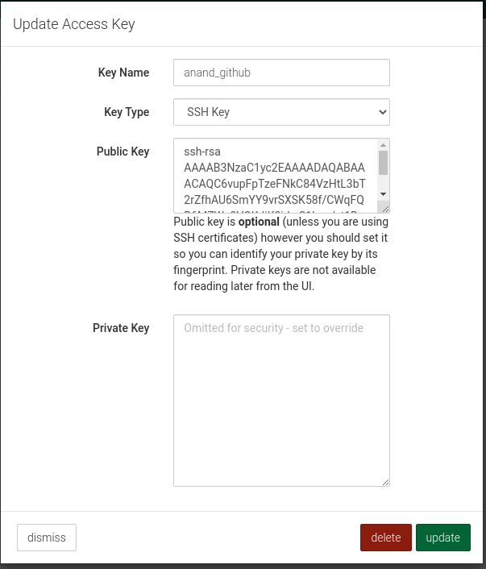
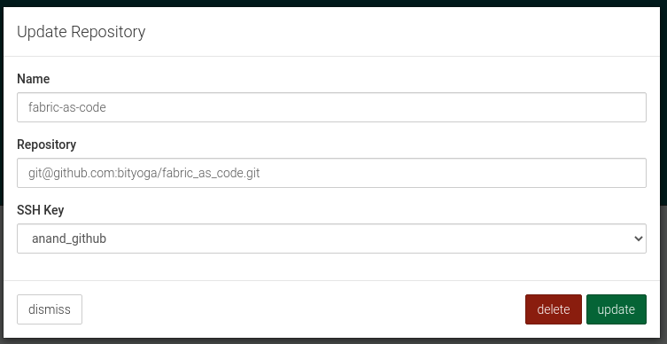
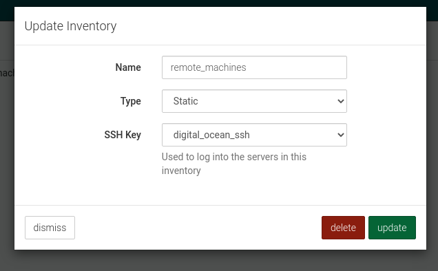
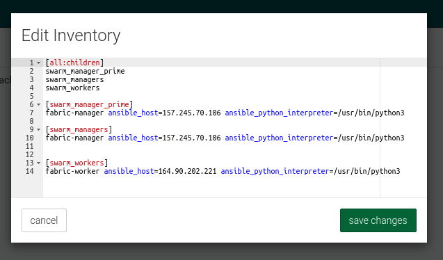
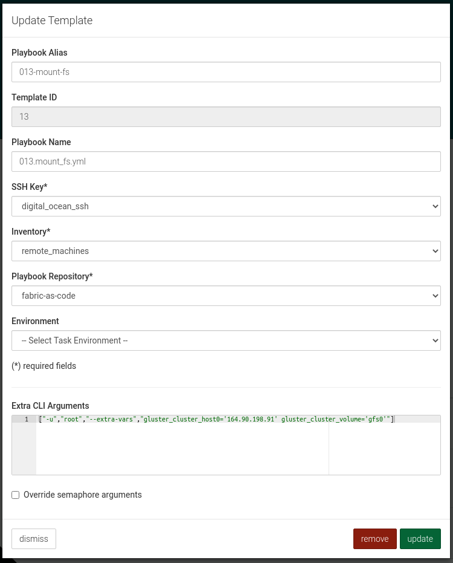
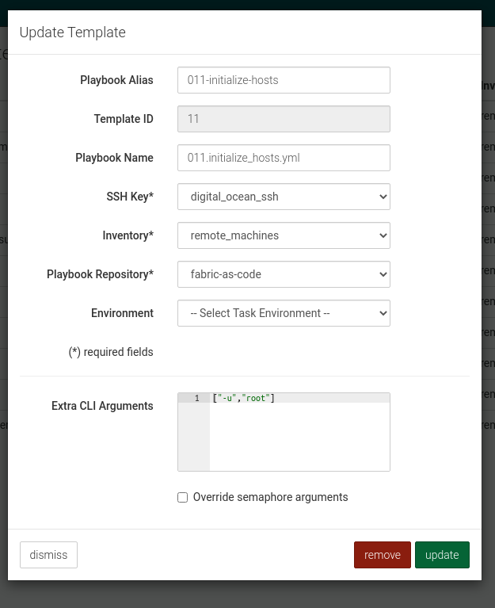

# Semaphore config instructions
## Pre-requisites: 
- Ensure that **ansible-semaphore is set up**. Please see [https://github.com/ansible-semaphore/semaphore] for further details on setting up ansible-semaphore.
Once ansible-semaphore is installed, you can verify it by accessing its url.

## ansible-semaphore Instructions:

- **1) Create Access keys** - Click "Key Store" from the side-menu and click "create key" on top right corner
  - **Github ssh key** - ssh key of the github repository to be used
  - **Remote Machines ssh keys** - ssh key to access the resource machines of the cloud provider
  
  
  
- **2) Import github repository** - Click "Playbook Repositories" from the side-menu and click "create repository" on top right corner
  - Import the **fabric_as_code** using the **Github ssh key** created in step 1
  
  
  
- **3) Update Inventory** - Click "Inventory" from the side-menu and click "create inventory" on top right corner
  - Create one inventory for **Remote machines** using the **Remote Machines ssh keys** created in step 1
  
  **Remote machine inventory example :**
  
  
  
  
  - **Edit Remote machine inventory -** click "edit inventory" on the **remote machine's inventory** and update the ip addresses of the machines.
  
  
  
- **4) Create Task Templates** - Click "Task Templates" from the side-menu and click "new template" on top right corner
  - Create 11 Task Templates for the 11 playbooks as shown in the figure below:
  
  - **Extra CLI arugments for 013.mount_fs.yml task -** ["-u","root","--extra-vars","gluster_cluster_host0='164.90.198.91' gluster_cluster_volume='gfs0'"]
  
  
  
  - **Extra CLI arugments for all other tasks -** ["-u","root"]  (Replace "root" as per the username having root access in the remote machines)
  
  
    
- **5) Run Tasks** 
  - Run all of the 5 Tasks one by one.
  - Click "run" green button on the right corner of the each tasks
  - Click "run" green button on the bottom right corner of the "create task" pop up
  
  
  
  
  
  
 
  
